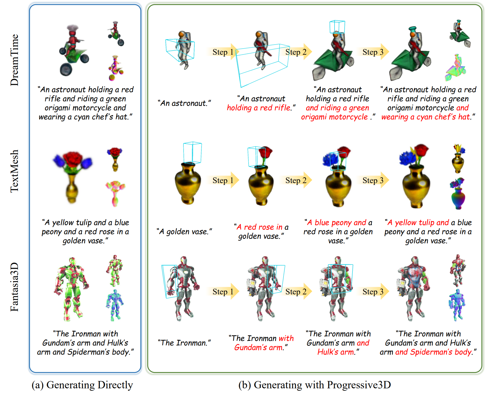

# Progressive3D: Progressively Local Editing for Text-to-3D Content Creation with Complex Semantic Prompts
[Xinhua Cheng](https://cxh0519.github.io/),
[Tianyu Yang](https://tianyu-yang.com),
[Jianan Wang](https://scholar.google.com/citations?user=mt5mvZ8AAAAJ),
[Yu Li](https://yu-li.github.io/),
[Lei Zhang](https://www.leizhang.org),
[Jian Zhang](https://jianzhang.tech/),
[Li Yuan](https://yuanli2333.github.io/)

  

<b>Conception.</b> Current text-to-3D methods suffer from challenges when given prompts describing multiple objects binding with different attributes. 
Compared to (a) generating with existing methods, (b) generating with Progressive3D produces 3D content consistent with given prompts.

## News

- [2023/10/20] Our code will open after the paper has been reviewed. 

## Bibtex

<pre><code>
    @misc{cheng2023progressive3d,
        title={Progressive3D: Progressively Local Editing for Text-to-3D Content Creation with Complex Semantic Prompts}, 
        author={Xinhua Cheng and Tianyu Yang and Jianan Wang and Yu Li and Lei Zhang and Jian Zhang and Li Yuan},
        year={2023},
        eprint={2310.11784},
        archivePrefix={arXiv},
        primaryClass={cs.CV}
    }
</code></pre>