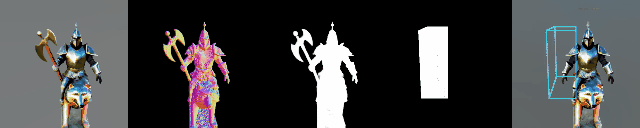

<h2 align="center">Progressive3D: Progressively Local Editing for Text-to-3D Content Creation with Complex Semantic Prompts</h2>
<!-- [Xinhua Cheng](https://cxh0519.github.io/),
[Tianyu Yang](https://tianyu-yang.com),
[Jianan Wang](https://scholar.google.com/citations?user=mt5mvZ8AAAAJ),
[Yu Li](https://yu-li.github.io/),
[Lei Zhang](https://www.leizhang.org),
[Jian Zhang](https://jianzhang.tech/),
[Li Yuan](https://yuanli2333.github.io/) -->

<h5 align="center">

[](https://arxiv.org/abs/2310.11784)
[](https://cxh0519.github.io/projects/Progressive3D/)
[](https://github.com/cxh0519/Progressive3D/blob/main/LICENSE) 

</h5>

<p align="center">
  
</p>

## 📋News
- **[2024/03/01]** 📢Our camera ready version is updated, and our code is released.
- **[2024/01/16]** 🎊Progressive3D is accepted by **ICLR 2024**.
- **[2023/10/20]** 📢Our paper is released in Arxiv.


## 🔧Installation
Progressive3D is implemented as an extension for threestudio.
To use it, please install [threestudio](https://github.com/threestudio-project/threestudio) first and then install this extension in threestudio `custom` directory.
Please also install [MVDream extension](https://github.com/DSaurus/threestudio-mvdream) in threestudio `custom` directory with their instructions.
```
cd custom
git clone https://github.com/cxh0519/Progressive3D.git
mv Progressive3D/threestudio-progressive3d/ .
pip install open3d
```

## 🚀Quick Start
```
# We should firstly generate a base 3D content with current text-to-3D generation method, e.g. MVDream
python launch.py --config custom/threestudio-mvdream/configs/mvdream-sd21-shading.yaml --train --gpu 0 system.prompt_processor.prompt="a medieval soldier with metal armor"

# We then edit the generated 3D content with our Progressive3D
python launch.py --config custom/threestudio-progressive3d/configs/mvdream-progressive3d.yaml --train --gpu 0 system.prompt_processor.prompt="a medieval soldier with metal armor|a medieval soldier with metal armor riding a terracotta wolf" resume="your_path_to_the_ckpt_of_generated_3D_content"

# Progressive3D can locally edit 3D content as a series of steps
python launch.py --config custom/threestudio-progressive3d/configs/mvdream-progressive3d_2.yaml --train --gpu 0 system.prompt_processor.prompt="a medieval soldier with metal armor riding a terracotta wolf|a medieval soldier with metal armor riding a terracotta wolf and holding a golden axe" resume="your_path_to_the_ckpt_of_edited_3D_content"
```
If everything goes well, you can obtain following result:

<p align="center">
  
</p>

## 🔔Tips
**[Configs]** Each edit step needs 10000 steps for optimizing. 
Therefore, ``max_steps`` needs to be modified in different editing processes.
Moreover, many configs should be relative to the ``max_steps`` including ``resolution_milestones, ambient_only_steps, min/max_step_percent, lambda_consistency/init``, more details can be referred in provided configs.

**[Prompt]** Expected input prompt format is A|B, where A is the source prompt and B is the target prompt.

**[Region Defination]** The editable region is defined as ``box_info=[box center; box size]`` in configs. Noticing that editable regions can be defined as multiple boxes:
```
# Example for inputing multiple boxes as region defination 
box_info: 
  - [2.0, 0.5, 1.0, 0.0, 0.0, -0.6]
  - [1.0, 0.4, 1.0, 0.0, -0.4, 0.2]
```

**[Axis]** The positive directions of the x,y,z-axis in Progressive3D are point out of screen, point to right and point to up, respectively.

**[Camera Move]** ``move_camera`` in configs determines whether use camera move techique or not. Concretely, camera will move towards to the direction of editable regions if ``move_camera=True``, which enhances the editing peformance for many cases.

## 📌Citation
If you find our paper and code useful in your research, please consider giving a star and citation.
<pre><code>
    @misc{cheng2023progressive3d,
        title={Progressive3D: Progressively Local Editing for Text-to-3D Content Creation with Complex Semantic Prompts}, 
        author={Xinhua Cheng and Tianyu Yang and Jianan Wang and Yu Li and Lei Zhang and Jian Zhang and Li Yuan},
        year={2023},
        eprint={2310.11784},
        archivePrefix={arXiv},
        primaryClass={cs.CV}
    }
</code></pre>